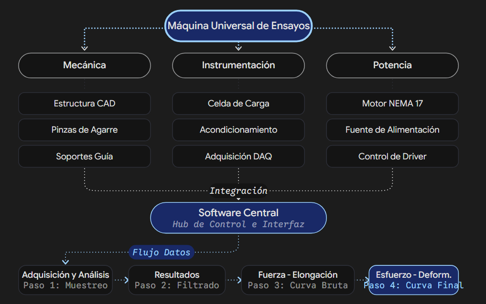

# UTM Lab — Máquina Universal de Ensayos de Fuerza de Bajo Costo

> Sistema de instrumentación, adquisición de datos en tiempo real y caracterización mecánica de materiales (hasta 100 N) desarrollado con microcontrolador Arduino, celda de carga de 10 kg, accionamiento NEMA 17 y plataforma web moderna en Next.js / Supabase / Google Gemini / Vercel.

---

## 1. Introducción y Contexto

La **ciencia de materiales** estudia las propiedades mecánicas, físicas y químicas de los materiales para comprender su comportamiento bajo cargas externas y fundamentar aplicaciones tecnológicas. Entre las propiedades de mayor interés se encuentran la resistencia a la tracción, la deformación elástica/plástica y el módulo de Young.

Las **máquinas universales de ensayos (UTM)** industriales convencionales son equipos voluminosos, de costo elevado (miles de dólares) y con características excesivas para laboratorios de docencia o caracterización de probetas poliméricas a pequeña escala.

Ante esta necesidad, el proyecto propone el **diseño, construcción y validación de una máquina universal de ensayos de fuerza de bajo costo y dimensiones reducidas**, integrando componentes comerciales accesibles, acondicionamiento de señales de precisión, microcontrolador local y una aplicación web moderna para adquisición serial directa en el navegador, graficado en vivo y exportación local trazable sin costos de almacenamiento cloud.

---

## 2. Objetivos

### Objetivo Principal
**Diseñar, construir y validar un prototipo de máquina universal de ensayos de fuerza de bajo costo**, capaz de aplicar una fuerza controlada (con límite de seguridad de 100 N) y registrar la respuesta mecánica de probetas poliméricas.

### Objetivos Específicos
* **Estructura mecánica:** Diseñar y fabricar la estructura física, guías lineales y mordazas de sujeción para probetas.
* **Sistema de accionamiento:** Implementar el control de desplazamiento mediante un motor paso a paso NEMA 17 y su etapa de potencia.
* **Instrumentación y acondicionamiento:** Integrar y calibrar una celda de carga de 10 kg (~100 N) con conversor ADC de alta resolución (HX711 o similar).
* **Plataforma de software:** Desarrollar una interfaz web (UTM Lab) con Web Serial API, visualización en tiempo real y asistencia inteligente mediante Google Gemini.
* **Curvas esfuerzo–deformación:** Calcular en tiempo real $\sigma$ (esfuerzo) y $\varepsilon$ (deformación) a partir de los datos geométricos de la probeta y las lecturas calibradas.
* **Evaluación experimental:** Evaluar la resolución, repetibilidad y respuesta del prototipo con diferentes muestras poliméricas comerciales e impresas en 3D.

---

## 3. Integrantes y Responsabilidades

| Integrante | Rol / Especialidad | Responsabilidades Principales |
| :--- | :--- | :--- |
| **Dante Aliguere Olivas Huaman** | **Software y Plataforma Web** | Arquitectura de software en Next.js, adquisición serial v1 con Web Serial API, validación CRC-16, autenticación y perfiles en Supabase, agente de IA con Google Gemini, exportación local PDF/CSV y despliegue en Vercel. |
| **Jhosep A. Tineo Santa Cruz** | **Instrumentación y Sensores** | Acondicionamiento de señal para celda de carga de 10 kg, etapa de amplificación/digitalización, integración con Arduino, calibración metrológica y evaluación de estabilidad. |
| **Juan Jesus Agüero Ventura** | **Estructura Mecánica** | Modelado CAD 3D de la máquina, diseño y fabricación de pinzas de sujeción (mordazas), cálculo de tolerancias, soporte de guías y rigidez estructural. |
| **------RETIRADO------** | **Potencia y Accionamiento** | Selección del motor paso a paso NEMA 17, driver de potencia, dimensionamiento eléctrico, fuente de alimentación y control de velocidad/torque del actuador. |

---

## 4. Arquitectura del Sistema

El sistema opera bajo un modelo desacoplado: **el firmware local garantiza la seguridad física y la temporización crítica**, mientras que **el navegador web visualiza, procesa y genera los reportes**.

<p align="center">
  
</p>

```text
┌────────────────────────────────────────────────────────────────────────────────────────┐
│                                 CAPA DE CONTROL LOCAL                                  │
│                                                                                        │
│   [ Celda de Carga 10 kg ] ──> [ ADC / Acondicionamiento ]                             │
│                                           │                                            │
│   [ Finales de carrera / Paro ] ────────> [ Microcontrolador Arduino ]                 │
│                                           │ (Uno / Nano - ATmega328P)                  │
│   [ Driver de potencia ] <────────────────┘                                            │
│            │                                                                           │
│   [ Motor NEMA 17 + Tornillo ] ──> [ Desplazamiento mecánico ]                         │
└───────────────────────────────────────────┬────────────────────────────────────────────┘
                                            │ Cable USB (Protocolo Serial v1 con CRC-16)
                                            ▼
┌────────────────────────────────────────────────────────────────────────────────────────┐
│                              CAPA DE SOFTWARE (UTM LAB)                                │
│                                                                                        │
│   Navegador del Operador (Chrome / Edge)                                               │
│   ├── Web Serial API (Lectura bidireccional local, detección de saltos de seq)         │
│   ├── Motor de cálculo en vivo (Esfuerzo en MPa, Deformación de ingeniería)            │
│   ├── Interfaz gráfica React 19 / Recharts (Curva sin datos sintéticos)                │
│   └── Asistente de Operación flotante (Chat contextual con Google Gemini)              │
│                                                                                        │
│   Servicios en la Nube                                                                 │
│   ├── Vercel (Alojamiento Edge/Serverless con HTTPS obligatorio)                       │
│   ├── Supabase Auth (Acceso seguro por correo y contraseña de operadores)              │
│   └── Google Gemini API (Respuestas contextualizadas mediante Gemini)        │
│                                                                                        │
│   * Cero Consumo de Almacenamiento Cloud: Todos los datos de ensayos (curvas,          │
│     muestras completas y reportes PDF/CSV) se generan en el navegador del operador     │
│     y se descargan directamente a su equipo local.                                     │
└────────────────────────────────────────────────────────────────────────────────────────┘
```

---

## 5. Plataforma de Software (UTM Lab)

La aplicación web ha sido construida con los más altos estándares modernos de desarrollo:

* **Framework:** [Next.js 15](https://nextjs.org/) con React 19 y TypeScript en App Router.
* **Adquisición Serial:** [Web Serial API](https://developer.mozilla.org/en-US/docs/Web/API/Web_Serial_API) en el cliente. Permite seleccionar puertos COM directamente desde el diálogo nativo del navegador, sin intermediarios en la nube.
* **Autenticación y Perfiles:** [Supabase Auth](https://supabase.com/) con **correo y contraseña (Email/Password)** y tabla `profiles` protegida con RLS (*Row Level Security*). Supabase se utiliza únicamente para el control de acceso de operadores.
* **Visualización en Vivo:** [Recharts](https://recharts.org/) configurado para trazado en tiempo real sin datos de demostración o sintéticos.
* **Exportación Local (Cero Consumo Cloud):**
  - **Reporte PDF Formal:** Generación directa en el navegador con `jsPDF`, capturando la curva en alta resolución, agregando metadatos de la probeta, resultados calculados ($F_{\max}$, $\sigma_{\max}$, $\varepsilon_{\max}$) y tabla de puntos de muestreo representativos.
  - **Datos Crudos en CSV:** Descarga directa de la matriz completa de mediciones con metadatos versionados para análisis en Excel, Python o MATLAB.
* **Asistente de IA (Google Gemini):** Ruta API Serverless en `/api/assistant` integrada con Google Generative AI (`gemini-3.8-flash`). Asiste al operador en la interpretación de mensajes del controlador, normas de ensayo y diagnóstico de alertas sin permisos de control físico directo.

---

## 6. Protocolo Serial v1 (Hardware ↔ Software)

La comunicación entre el microcontrolador y la aplicación web se realiza a través de tramas de texto estructuradas con confirmación y suma de verificación.

### 6.1. Comandos de Control (Handshake)

Todas las órdenes enviadas por la interfaz web llevan un identificador UUID único. El firmware debe responder con un mensaje `ACK`:

```text
// 1. Handshake inicial
CMD,id=<uuid>,type=HELLO
ACK,id=<uuid>,status=OK

// 2. Armado de ensayo (con perfil de calibración validado)
CMD,id=<uuid>,type=ARM_TEST,calibration_profile=<perfil_id>
ACK,id=<uuid>,status=OK

// 3. Inicio del desplazamiento y muestreo
CMD,id=<uuid>,type=START_TEST
ACK,id=<uuid>,status=OK

// 4. Parada de ensayo
CMD,id=<uuid>,type=STOP_TEST
ACK,id=<uuid>,status=OK
```

Si el firmware detecta una condición insegura (paro presionado, sobrecarga, calibración ausente), rechaza la orden de forma segura:
```text
ACK,id=<uuid>,status=ERROR,reason=Paro_de_emergencia_activado
```

### 6.2. Tramas de Muestras (`SAMPLE`)

Cada punto de ensayo se transmite en una sola línea terminada en `\n`:

```text
SAMPLE,seq=42,t_ms=1200,force_raw=4567,displacement_raw=123,force_n=101.22,displacement_mm=0.42,crc=ABCD
```

* `seq`: Secuencia incremental entera (permite detectar pérdidas de muestras si hay saltos).
* `t_ms`: Tiempo de ejecución en milisegundos generado por el timer del microcontrolador.
* `force_raw` / `displacement_raw`: Lecturas crudas del ADC/contador de pasos.
* `force_n`: Fuerza física calculada y calibrada en Newtons (N).
* `displacement_mm`: Desplazamiento medido en milímetros (mm).
* `crc`: Checksum **CRC-16/CCITT** en formato hexadecimal de 4 dígitos, calculado sobre todo el texto previo a `,crc=`.

> [!IMPORTANT]
> Las muestras recibidas con CRC inválido son descartadas de inmediato. Si se detecta un salto de secuencia (por ejemplo, de `seq=10` a `seq=14`), la interfaz registra las muestras perdidas y lo consigna en el reporte.

### 6.3. Eventos Asíncronos de Seguridad (`EVENT`)

El firmware notifica eventos críticos de inmediato:
```text
EVENT,type=OVERLOAD,detail=Fuerza_excede_100N
EVENT,type=LIMIT_REACHED,detail=Final_de_carrera_superior
EVENT,type=FAULT,detail=Error_lectura_celda
EVENT,type=TEST_FINISHED
```

### 6.4. Firmware de Control en Arduino (`firmware/utm_controller/utm_controller.ino`)

El proyecto incluye el código completo de firmware listo para cargar en microcontroladores **Arduino Uno / Nano (ATmega328P)**:

* **Ruta del código:** [`firmware/utm_controller/utm_controller.ino`](firmware/utm_controller/utm_controller.ino)
* **Velocidad de transmisión:** `115200 baudios`.
* **Frecuencia de telemetría:** `10 Hz` (cada 100 ms).
* **Asignación de Pines por Defecto:**

| Pin Arduino | Función | Conexión Física |
| :---: | :--- | :--- |
| **D2** | Paro de emergencia | Pulsador normalmente cerrado a GND (pull-up interno) |
| **D3** | Final de carrera superior | Switch normalmente cerrado a GND (pull-up interno) |
| **D4** | Final de carrera inferior | Switch normalmente cerrado a GND (pull-up interno) |
| **D5** | STEP | Entrada STEP del driver NEMA 17 (A4988 / DRV8825) |
| **D6** | DIR | Entrada DIR del driver NEMA 17 |
| **D7** | ENABLE | Entrada ENABLE del driver (LOW = activo) |

---

## 7. Modelo Matemático de Ensayos

A partir de la geometría inicial ingresada por el operador y los valores calibrados transmitidos por el microcontrolador:

$$\sigma = \frac{F}{A_0} \quad [\text{MPa}]$$

$$\varepsilon = \frac{\Delta L}{L_0} \quad [\text{adimensional}]$$

* **$F$:** Fuerza calibrada medida por la celda de carga en Newtons ($N$).
* **$A_0$:** Área transversal inicial de la probeta en $\text{mm}^2$ ($A_0 = \text{ancho} \times \text{espesor}$).
* **$\Delta L$:** Desplazamiento medido en $\text{mm}$.
* **$L_0$:** Longitud calibrada inicial de la probeta en $\text{mm}$.
* **$\sigma$:** Esfuerzo de ingeniería en megapascales ($1\,\text{N/mm}^2 = 1\,\text{MPa}$).
* **$\varepsilon$:** Deformación unitaria (mostrada en la interfaz como porcentaje $\%$).

---

## 8. Puesta en Marcha Local

### 8.1. Requisitos Previos
* **Node.js:** Versión 20.x o superior.
* **Navegador:** Google Chrome o Microsoft Edge (requerido para Web Serial API).
* **Arduino IDE:** Versión 1.8.x o 2.x con placa Arduino Uno / Nano conectada por USB.
* **Supabase:** Proyecto en la nube o local (sólo requiere autenticación habilitada).
* **Google Gemini API:** Clave de API para el asistente técnico (gratuita en [Google AI Studio](https://aistudio.google.com/)).

### 8.2. Carga del Firmware en Arduino IDE

1. Conecte el Arduino Uno o Nano a su computadora mediante cable USB.
2. Abra **Arduino IDE**.
3. Vaya a **Archivo → Abrir...** y seleccione [`firmware/utm_controller/utm_controller.ino`](firmware/utm_controller/utm_controller.ino).
4. En **Herramientas → Placa**, seleccione *Arduino Uno* o *Arduino Nano* (si utiliza un clon Nano, seleccione el procesador *ATmega328P (Old Bootloader)*).
5. En **Herramientas → Puerto**, seleccione el puerto COM detectado.
6. Haga clic en **Subir** (Upload).
7. > [!IMPORTANT]
   > **Cierre el Monitor Serie de Arduino IDE antes de conectar desde la aplicación web.** El puerto COM es de acceso exclusivo y la Web Serial API no podrá abrirlo si Arduino IDE lo tiene retenido.

### 8.3. Configuración y Ejecución de la Plataforma Web

1. Clonar el repositorio e instalar las dependencias:
   ```bash
   git clone https://github.com/LordPercival241/maquina-de-ensayos-esfuerzo-deformacion.git
   cd "UTM - Proyecto de Instrumentación"
   npm install
   ```

2. Crear el archivo `.env.local` a partir de la plantilla:
   ```powershell
   Copy-Item .env.example .env.local
   ```

3. Completar las variables en `.env.local`:
   ```dotenv
   # Variables públicas de Supabase
   NEXT_PUBLIC_SUPABASE_URL=https://<tu-proyecto>.supabase.co
   NEXT_PUBLIC_SUPABASE_ANON_KEY=<tu-anon-key>

   # Variables privadas de servidor (Google Gemini API)
   GEMINI_API_KEY=AIzaSy...
   GEMINI_MODEL=gemini-2.5-flash
   ```

4. Configurar la base de datos en Supabase:
   * Abra el **SQL Editor** de su proyecto en Supabase.
   * Ejecute la migración [`supabase/migrations/202609180001_initial.sql`](supabase/migrations/202609180001_initial.sql).
   * Verifique en **Authentication → Providers** que **Email** esté habilitado.

5. Iniciar el servidor de desarrollo:
   ```bash
   npm run dev
   ```
   Abra `http://localhost:3000` en Chrome o Edge.

### 8.4. Scripts Disponibles

```bash
npm run dev        # Servidor de desarrollo con Next.js
npm run build      # Compilación optimizada para producción
npm run start      # Servidor en modo producción
npm run lint       # Análisis estático de código con ESLint
npm run typecheck  # Verificación estricta de tipos TypeScript
```

---

## 9. Despliegue en Producción (Vercel)

El proyecto está 100% optimizado para desplegarse en **Vercel**:

1. Suba su rama a GitHub y vincule el repositorio en el panel de [Vercel](https://vercel.com).
2. En **Settings → Environment Variables** en Vercel, agregue las siguientes 4 variables:
   * `NEXT_PUBLIC_SUPABASE_URL`
   * `NEXT_PUBLIC_SUPABASE_ANON_KEY`
   * `GEMINI_API_KEY`
   * `GEMINI_MODEL` (valor configurado: `gemini-2.5-flash`)
3. En **Supabase → Authentication → URL Configuration**, añada su dominio de Vercel (`https://<proyecto>.vercel.app`) en *Site URL* y en *Redirect URLs*.
4. Realice el despliegue con el botón **Deploy**.

> [!TIP]
> **Compatibilidad HTTPS y Web Serial en Vercel:**
> La Web Serial API exige de forma obligatoria un contexto seguro (HTTPS). Al desplegar en Vercel, el dominio obtiene un certificado SSL automático y el archivo `next.config.ts` ya contiene la cabecera `Permissions-Policy: serial=(self)` requerida para autorizar el acceso al puerto USB.

---

## 10. Estado del Proyecto y Hoja de Ruta

- [x] Definición conceptual y parámetros de diseño (límite 100 N).
- [x] Distribución de responsabilidades entre los cuatro integrantes.
- [x] Adquisición de componentes clave (Arduino, celda 10 kg, motor NEMA 17, driver).
- [x] Desarrollo de la plataforma web en Next.js con soporte Web Serial, Recharts y Google Gemini.
- [x] Autenticación de operadores en Supabase con RLS y exportación local de reportes PDF/CSV (cero consumo cloud).
- [x] Implementación completa del firmware en Arduino con protocolo Serial v1, CRC-16/CCITT y bloqueos de seguridad ([`firmware/utm_controller/utm_controller.ino`](firmware/utm_controller/utm_controller.ino)).
- [x] Validación de compilación y preparación para despliegue en Vercel.
- [ ] Calibración experimental con masas patrón de la celda de carga de 10 kg.
- [ ] Fabricación de piezas CAD definitivas (mordazas y soportes de guías).
- [ ] Ensayos de tracción con probetas poliméricas (PLA, PETG, ABS) y trazado experimental de curvas.

---

## 11. Documentación Complementaria

* [Firmware para Arduino Uno / Nano](firmware/utm_controller/utm_controller.ino)
* [Guía de puesta en marcha rápida](docs/SETUP.md)
* [Migración de base de datos para Supabase](supabase/migrations/202609180001_initial.sql)
* [Documento de Estado del Arte](Estado%20del%20arte_Olivas_Tineo_Ag%C3%BAero_%20Sanchez.pdf)
